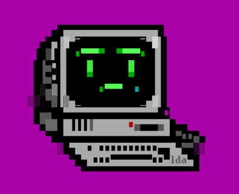

import { LinkButton } from '@astrojs/starlight/components';

  

    

    With SadConsole you can make ascii-styled games for modern platforms. At its heart, SadConsole is really a giant tile-based game engine. However, its object model is conceptually similar to a traditional **console** app.

    SadConsole is offered as a [NuGet package](https://www.nuget.org/packages/SadConsole/) and supports MonoGame, SFML, and FNA as rendering engines.

    <LinkButton href="getting-started/cli">Get Started</LinkButton>

    Here are some of the features SadConsole supports:

    - Show any number of consoles of any size
    - Fonts are ASCII-styled tile sets, and supports any number of tiles/glyphs.
    - Multiple fonts in your game
    - Text-styled GUI controls and Window system
    - Theming system for GUI
    - Mouse and Keyboard support
    - Read ansi files from the good old DOS days
    - Animated consoles
    - Instruction engine

    

  

  

    
  

